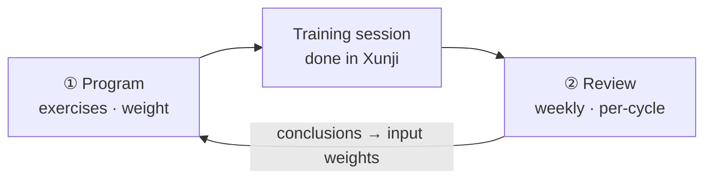

# ai-training-planner

> A self-hosted AI training coach with exactly two jobs: **program your training** — down to the weight on the bar — and **review it**, feeding what it learns back into the next round as explicit weighting.

**English** | [中文](README.zh-CN.md)

---

## The loop

This is the whole system in one picture. Everything else is implementation detail.



## What it is, and what it isn't

**It is** a planning system that runs on your own machine. It reads your training history, finds the holes in your split, the movements you keep repeating, the muscle groups that keep getting skipped — then programs the coming week and tells you what weight to put on the bar. At the end of a cycle it reviews how it went.

**It isn't** another workout tracker. Day-to-day logging and execution stay in [Xunji](https://trains.xunjiapp.cn) — this system doesn't try to take that over.

**The full loop works today**: read history → program → human review → write back to Xunji → log how each session felt → weekly review → per-cycle snapshot.

## Why this exists

Years of training data sitting in Xunji, doing nothing. And the same planning problems every time: a split that doesn't hold up, the same stimulus over and over, muscle groups that quietly get ignored, no idea how to adjust for the next block. Plus the daily tax of deciding *what am I doing today*.

These are exactly the kind of thing a model is good at — **provided you don't just dump 26 weeks of raw logs into the prompt.**

## Design trade-offs

These decisions shape the whole system and say more about it than any feature list.

**1. The model never sees the raw history.**
History is compressed locally into a "digest layer" first (training profile + weekly summaries + computed progressive-overload numbers). The model only reads the digest. Prompt size stays bounded and output stays stable, and it doesn't get more expensive just because you trained for another two months.

**2. Progressive overload is computed locally; the model only handles exceptions.**
Adding weight is arithmetic — it has no business being decided by a probabilistic model. How much to add, and how to back off when you stall, is all computed locally. The model is only asked the questions that actually need judgement, like whether a movement should be swapped out.

**3. Writing back to Xunji has two gates, and no automatic path.**
`draft → approve → dry-run (purely local) → confirm (requires a literal confirmation) → write`. Writes go out one day per batch, strictly serial, with a cooldown between batches. Every write must be read back and verified — Xunji's success response doesn't echo the data, so without reading back there's no way to tell "wrote successfully" apart from "silently dropped by rate limiting". A write interrupted by the process being killed is marked `uncertain`, **never** `failed` — an unknown outcome must never be silently retried.

**4. No scheduler.**
There used to be one. It's gone. Every flow is triggered by a button in the UI. On startup the system does exactly three things (reset orphaned jobs, archive stale drafts, run one incremental sync) and every one of them is read-only. One less layer of "what did it do by itself at 3am".

**5. Local-first.**
SQLite on your own disk, server bound to `127.0.0.1`. Your training data doesn't leave the machine.

## Getting started

Requires **Node.js >= 22.13** (it uses the built-in `node:sqlite` — no database server to install).

```bash
git clone <this-repo>
cd ai-training-planner
npm install

cp .env.example .env         # Windows: Copy-Item .env.example .env
# then edit .env and fill in at least XUNJI_API_KEY

npm run build                # compile the backend
npm run build:web            # compile the frontend (required after any frontend change)

npm run server               # start, then open http://127.0.0.1:8787
```

On Windows you can also just double-click `start-server.bat` (it detects whether the port is already taken and, if so, only opens the page).

The first launch shows a three-step onboarding flow for your Xunji key, training basics, and basic body info. Saving the key triggers one full history import automatically (measured: ~9 seconds for 182 days).

### The two keys

| Variable | Required | Notes |
|---|---|---|
| `XUNJI_API_KEY` | ✅ | Xunji Open API key. Without it, nothing can be fetched |
| `LLM_API_KEY` | recommended | Not an error if missing — planning falls back to a rule-based template, but you lose everything the model contributes |

Neither key requires editing `.env` by hand: you can enter both from the settings page, and saving writes them to `.env` and takes effect **immediately, with no restart**. Keys live only in `.env` (which is gitignored), are never stored in the database, never logged, never sent to the frontend, and the UI only ever shows `****last4`.

The AI side defaults to DeepSeek. Any OpenAI-compatible endpoint works (Qwen / Kimi / a local vLLM / Ollama, etc.) — change `LLM_BASE_URL` and `LLM_MODEL` and the protocol stays the same.

> ⚠️ Set `LLM_MAX_TOKENS` generously. It's the budget **including reasoning tokens**, not "the budget for writing JSON" — a reasoning model burns roughly 7,700 tokens thinking before it writes a weekly plan. Give it 8192 and the response gets hard-truncated, JSON parsing fails, and you fall back to the template. Default is 32768.

## Data source: Xunji, and what comes after

Xunji is the only integration implemented today, but **the ingestion layer is deliberately isolated**. Reading lives in `server/xunji/`; the mapping between movement names and muscle groups lives in `seeds/` as a general-purpose table. Planning and review logic never touches Xunji's response format directly.

So adapting this to a different logging app means changing those two places — not the planning logic. To be honest about the scope: this is a *replaceable* integration point, not a drop-in plugin system. Expect to write adapter code.

## Tech stack

| Layer | Choice | Notes |
|---|---|---|
| Runtime | Node 22 + TypeScript (ESM) | Compiled straight with `tsc`; no bundler |
| Database | `node:sqlite` | Built into Node, zero extra dependencies, no ORM |
| Backend | Hand-rolled `node:http` routing | A dozen handlers don't justify a framework |
| Frontend | React 19 + TanStack Query 5 | Hash routing written by hand; no router library |
| Styling | Tailwind 4 + Vite 8 | |

## Project structure

```
src/                Frontend (React)
  pages/            Home / Review / Settings / Confirm-import / Analysis
  components/       Split by domain: plan, settings, analysis, onboarding, layout, common
  api/client.ts     Single entry point for all requests and TanStack Query hooks

server/             Backend
  api/routes/       Routing layer, deliberately thin — logic always lives in a service
  db/               Schema and connection handling
  ai/               Model gateway (retries, validation, fallback)
  xunji/            Xunji API client (read truncation, rate limiting, error classification)
  analysis/         Local digest layer and trend analysis
  plan/             Programming, progressive overload, write-back to Xunji
  review/           Weekly and per-cycle review
  jobs/             In-process single-queue job runner
  onboarding/       First-run wizard

tests/              node:test cases (490+)
docs/               Design and measurement docs — see below
scripts/            Build scripts and the Xunji API probe
seeds/              Movement / muscle-group mapping tables
```

## Docs

- **[docs/PRD-v2.md](docs/PRD-v2.md)** — the product definition and the single source of truth. When a design question comes up, this wins.
- **[docs/probe-report.md](docs/probe-report.md)** — measured behaviour of the Xunji Open API. Rate limits, truncation, and error codes that you cannot learn from official docs — all of it comes from here.
- [docs/onboarding-plan.md](docs/onboarding-plan.md) — design and decision criteria for the first-run wizard.

## Known limits

- **Bound to `127.0.0.1` with no authentication.** That's deliberate — it's a single-user tool for one machine. **Do not expose it to the public internet**: the settings page's key-write endpoint rewrites the server's `.env`, so making it public means anyone can replace your keys. If you want it on your phone, use something like Tailscale rather than port forwarding.
- **Don't enable GitHub Pages.** This project needs a Node backend (SQLite, sync engine, model calls). The `index.html` in the repo root is only Vite's source template; the built output lives in `dist/web/` and must be served by the backend.
- **Writing back to Xunji is hard rate-limited**, roughly 65 seconds between batches. Importing a four-day plan takes about four minutes. That's a server-side limit; there's no way around it.
- One-off probe scripts used during development are **not** part of this repository.

## Development

```bash
npm run typecheck     # type check
npm run build         # compile backend
npm run build:web     # compile frontend
npm test              # compile + run the full test suite
npm run dev           # frontend dev server (5173, API proxied to 8787)
```

## License

MIT
